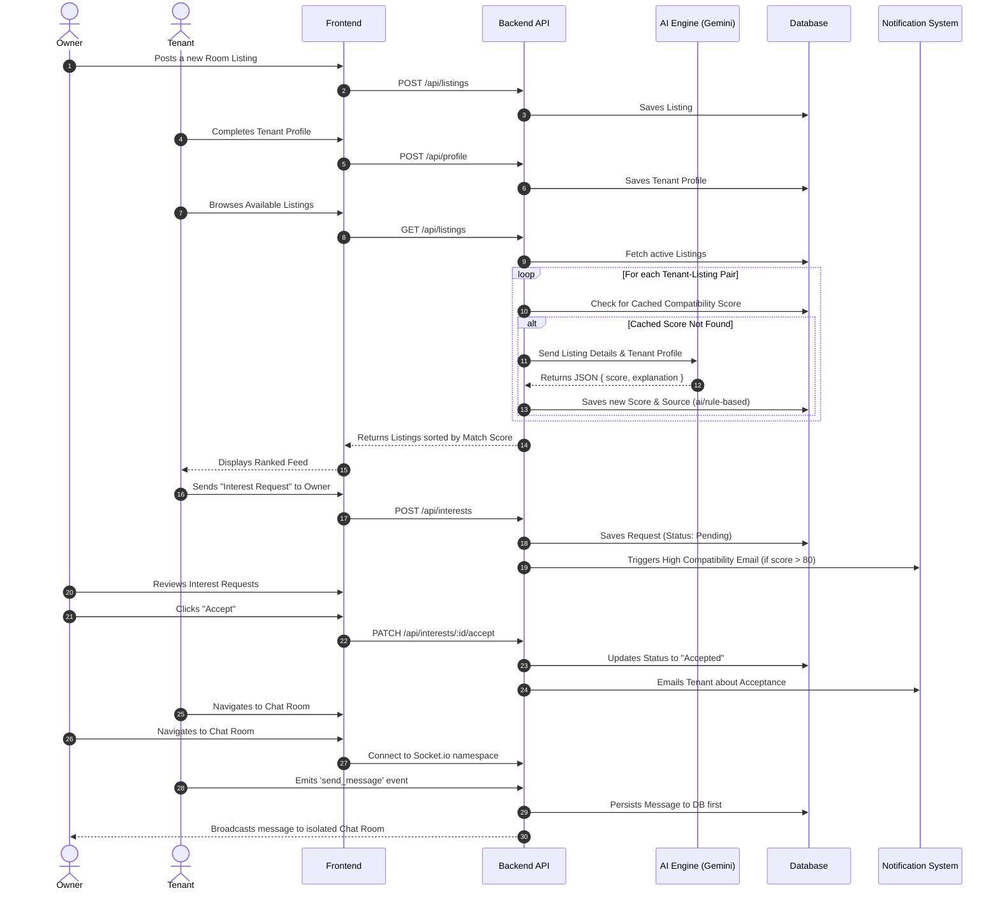
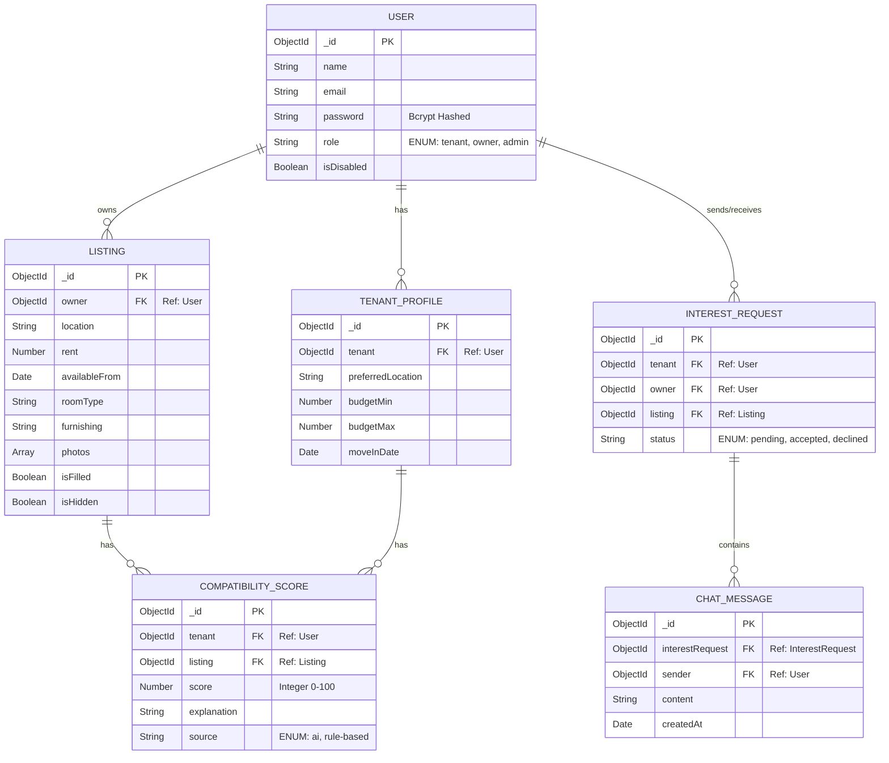

# Rent & Flatmate Finder - Comprehensive Interview Guide

This document provides an in-depth, end-to-end breakdown of the Rent & Flatmate Finder project. It is structured to help you answer architectural, technical, and product-focused questions during engineering interviews.

---

## 1. Vision and Problem Statement

### The Problem
Finding a flatmate is notoriously difficult and frustrating. Most traditional real estate or classified platforms allow users to filter listings solely by two primary metrics: **Price** and **Location**. While these are crucial filtering criteria (solving about 80% of the matching problem), they completely ignore the qualitative aspects of a living arrangement. The remaining 20%—lifestyle compatibility, daily habits, cleanliness expectations, and personality fit—is usually where flatmate relationships ultimately break down.

### The Solution
The Rent & Flatmate Finder project closes this gap by introducing a qualitative matching layer on top of standard filtering. It is a full-stack platform that pairs potential tenants with available rooms using an AI-powered compatibility engine. Instead of merely showing users a chronological feed of available rooms, the platform ranks listings based on how well the tenant's profile aligns with the room's attributes, ensuring users spend time looking at the most relevant options.

---

## 2. Core Application Control Flow

To understand the system, it is crucial to follow the lifecycle of user interactions. The platform orchestrates complex interactions between Owners, Tenants, the Backend API, the AI Engine, and the Database.

### Control Flow Diagram

### Flow Breakdown:
1. **Data Ingestion**: Owners post structured room listings, and tenants define structured lifestyle profiles.
2. **AI Processing**: As tenants browse, the backend asynchronously resolves compatibility scores using the LLM. It intelligently caches these scores so the LLM is only invoked once per pair.
3. **Handshake Protocol**: The system uses a dual-opt-in mechanism. Tenants signal interest; Owners must explicitly accept.
4. **Communication Layer**: Upon mutual opt-in, a secure WebSocket channel is instantiated for real-time messaging, with robust persistence guarantees.

---

## 3. Database Schema and Architecture

The application uses MongoDB (NoSQL) with Mongoose as the Object Data Modeling (ODM) library. The schema is highly normalized for a NoSQL database to ensure distinct separation of concerns and to facilitate efficient querying via specific compound indexes.

### Entity Relationship Diagram (ERD)

### Key Design Decisions in Schema:
- **Compound Unique Indexes**: We enforce uniqueness at the database level on `InterestRequest(tenant, listing)` and `CompatibilityScore(tenant, listing)`. This prevents race conditions where duplicate API calls could otherwise create redundant records.
- **Reference Over Embedding**: Unlike many basic MongoDB schemas that embed messages in the parent object, `CHAT_MESSAGE` is its own distinct collection referencing `INTEREST_REQUEST`. This ensures the chat history can scale infinitely without hitting MongoDB's 16MB document size limit.

---

## 4. Technical Stack & Justification

| Layer | Technology | Why we chose it |
|---|---|---|
| **Frontend UI** | React + Vite | React offers component-based architecture which is ideal for complex state (like search filters). Vite provides lightning-fast HMR (Hot Module Replacement) during development compared to CRA. |
| **Styling** | TailwindCSS | Utility-first CSS allows for rapid UI iteration without context-switching between JS and CSS files. It naturally promotes a consistent design system. |
| **Backend Core** | Node.js + Express | Single-language stack (JavaScript everywhere) reduces context switching. Express is unopinionated and fast, perfect for building RESTful APIs. |
| **Database** | MongoDB Atlas | Document-oriented storage is highly flexible, allowing schemas to evolve rapidly. It pairs natively with JSON/BSON structures used in JS. |
| **Authentication** | JWT + bcrypt | Stateless authentication using HTTP-only standard JSON Web Tokens. Bcrypt secures user passwords via heavy computational hashing. |
| **Real-time Engine**| Socket.io | Wraps raw WebSockets with automatic reconnection, room management, and broadcasting capabilities, which are essential for the chat feature. |
| **AI Integration** | Gemini API | Cost-effective and extremely fast at parsing text and outputting structured JSON natively. |
| **Email Service** | Nodemailer | Standard, reliable Node package for SMTP orchestration. |

---

## 5. Architectural Deep Dives

### A. The AI Compatibility Engine & Fallback Mechanism
Integrating third-party LLMs introduces points of failure (rate limits, timeouts, hallucinated schemas). 
- **The Prompt**: The prompt strictly instructs the LLM to evaluate Budget, Location, and Move-in Date, returning **only** a valid JSON object: `{ "score": 85, "explanation": "..." }`.
- **Validation**: The backend rigorously parses this output. If it is not valid JSON, or if the score is out of bounds, the AI response is discarded.
- **Deterministic Fallback**: If the LLM fails, the system immediately switches to an in-memory, deterministic rule-based scoring algorithm (giving 40% weight to budget, 30% to location, etc.). 
- **Result**: The end-user never experiences a crash or missing data. The score is saved with a `source: 'rule-based'` tag for engineering observability.

### B. Real-time Chat Implementation Architecture
Scaling WebSockets safely requires specific design patterns.
- **Room Isolation**: When an owner accepts an interest request, an ID is generated. When the users navigate to chat, `Socket.io` forces them to join a named "room" using this exact `interestId`. 
- **Persist-First Broadcasting**: When a message is sent, the server first writes it to the MongoDB `CHAT_MESSAGE` collection. Only after a successful database write does the server broadcast the message to the room via Socket.io. This prevents scenarios where a client sees a message that wasn't actually saved.

### C. Event-Driven Notification System
Emails (like high-compatibility alerts) are designed using a "fire-and-forget" pattern.
- The Node.js HTTP request lifecycle does not wait for the SMTP server to respond. The email functions are chained with `.catch()` block loggers. 
- The user gets their API response (e.g., "Request Sent") in milliseconds, while the Nodemailer payload resolves asynchronously in the background.

---

## 6. Security and Scalability Considerations

- **Authorization via Middleware**: Every protected route runs through a JWT verification middleware. Furthermore, role-based checks (e.g., `isAdmin`, `isOwner`) ensure tenants cannot manipulate listing states.
- **Password Security**: Passwords are never stored in plain text. They are hashed using bcrypt with an appropriate salt round.
- **Horizontal Scalability Ready**: Because JWTs are stateless, the backend Node instances can be scaled horizontally. The only stateful component is Socket.io, which can be scaled in the future by adding a Redis adapter for pub/sub messaging across multiple server nodes.

## 7. Summary
This project demonstrates proficiency in building a complete, production-ready full-stack application. It moves beyond simple CRUD operations by incorporating external AI logic, asynchronous message queues (websockets), smart caching layers, and deterministic fallback systems—all of which are highly relevant skills for modern software engineering roles.
